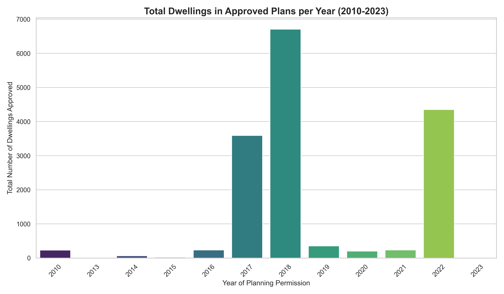
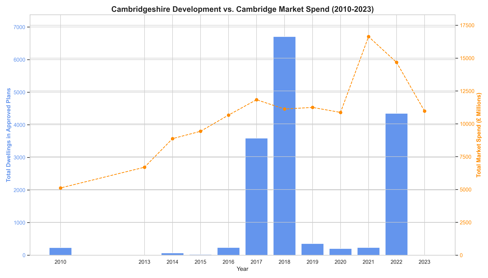
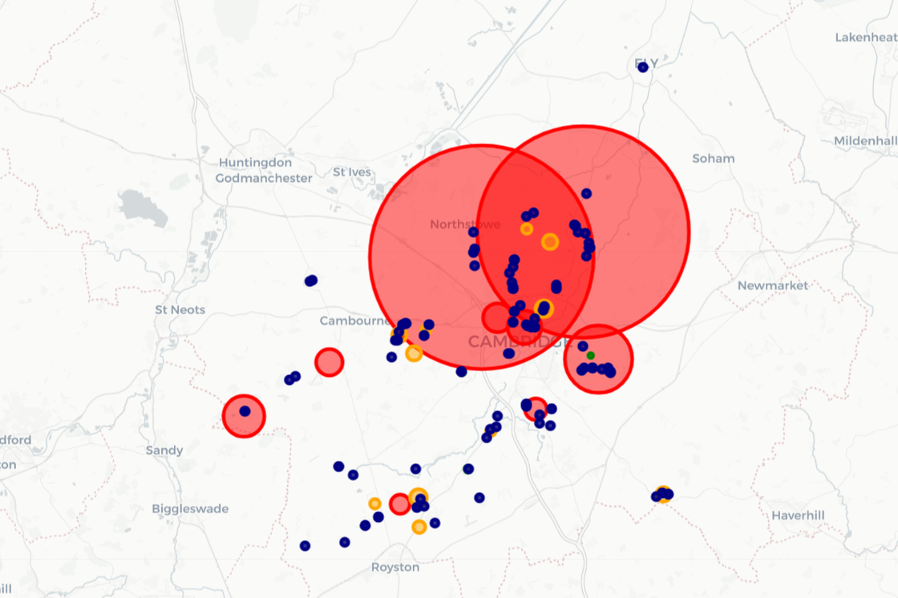

# Project Nebula: My Take on Cambridgeshire’s Property Development Scene

## Kicking Things Off: What’s This All About?

### So, What’s Brownfield Land Anyway?
Alright, let’s get this straight—Brownfield Land isn’t just some random patch of dirt. It’s a big deal in the UK’s housing game plan. We’re talking about land that’s been used before but is now sitting empty or rundown—think old factories, abandoned railway yards, shuttered shops, or even those sad little garage blocks. The government’s all about pushing developers to build on these spots first to spruce up neglected areas, make use of existing roads and pipes, and keep the green countryside from turning into a concrete jungle. This report is my deep dive into what’s happening with these sites in Cambridgeshire, trying to spot where the action’s at.

### How I Tackled It
I wanted to cut through the property market’s noise and find real trends, not just guesses. My goal? Figure out where development’s actually happening and what it means for Cambridgeshire’s growth, all with a solid, repeatable process. I rolled up my sleeves and built a Python workflow using Pandas and GeoPandas. Here’s the lowdown:

- **Grabbing the Data**: I started with one big national dataset of UK brownfield sites. Trust me, I tried using individual council data first, but it was a mess—different formats, missing bits, you name it. Going national gave me a reliable starting point.
- **Zooming in on Cambridgeshire**: I used a geospatial trick to “cut out” just the sites inside Cambridgeshire’s borders. Think of it like tracing the county on a digital map and picking only the dots inside. Way better than just searching “Cambridge” and hoping for the best.
- **Cleaning Up the Mess**: The Cambridgeshire data needed some serious TLC. I kicked out duplicates, making sure each site was counted once, using the latest planning application to keep things fresh.
- **Connecting to the Market**: I dug into a massive Land Registry file with every UK property sale since 1995. I sliced it down to Cambridgeshire sales from 2010 to 2023 to see how the market’s been vibing.
- **Making Sense of It**: I crunched the cleaned data to spot long-term trends and find the hot zones. Then, I used Matplotlib and Folium to whip up some clear charts and interactive maps to share what I found.

### The Data Wasn’t Exactly Cooperative
Let’s be real—the data wasn’t perfect. I hit a few bumps along the way:

- **Council Data Chaos**: Early on, I realized council datasets were all over the place—different formats, column names like “site-reference” one day and “SiteReference” the next, and some were just incomplete. That’s why I stuck with the national dataset; it was like finding a solid rock in a stormy sea.
- **Messy Addresses**: The address field was a free-for-all. One site might say “Fulbourn, Cambridge,” another just “Fulbourn,” or worse, barely anything. I built a list of Cambridgeshire towns and villages and wrote code to sort through the mess, grouping sites into “Sectors” for a solid hotspot analysis.

## Analysis 1: Tracking the Development Rollercoaster (2010-2023)
First up, I wanted to see how development’s been trending over time. I grouped all the approved sites by their decision year, and man, what a story it tells—boom, dip, and bounce-back.

### What’s the Deal?
- **The 2017-2018 Party**: Holy cow, those years were wild! Over 10,000 new homes got the green light in just two years. It screams big investment and confidence, probably fueled by a hot local economy and government housing goals.
- **The 2019-2021 Slump**: Things cooled off fast, with approvals dropping and staying low for three years. Call it a market “whoops” moment—maybe the boom filled up the pipeline, or stuff like economic jitters and the pandemic put a damper on new plans.
- **The 2022 Comeback**: By 2022, things were looking up again, with over 4,000 new homes approved. It’s like the market took a deep breath and said, “Alright, let’s do this again.”

## Analysis 2: Linking Development to Cash Flow
To get why these swings happened, I matched up the number of approved homes with how much money was spent on property sales in Cambridgeshire each year. Spoiler: there’s a tight connection.

### What I Learned:
- **Money Talks First**: The market was pumping from 2013, hitting a peak in 2016-2017. All that cash flying around—high sales, rising prices—set the stage for the 2017-2018 development explosion. Developers were like, “This is our moment!”
- **Planning Lags Behind**: Approvals don’t lead the market; they follow it. Developers need a few years of strong sales and price growth to feel bold enough to buy land and jump through planning hoops.

## Analysis 3: Where’s the Action Happening?
This part’s about finding the growth hotspots. By sorting projects into “Sectors” based on their parsed addresses, I figured out which towns and villages are driving the development train.

*Note: You’ll need to screenshot your Sector_Hotspot_Map.html file and save it as Sector_Hotspot_Map_Screenshot.png in the reports folder for this to work.*

### What’s Popping?
- **The Big Dogs: Oakington and Waterbeach**: These two are killing it, accounting for a whopping 89% of all new homes approved. Big brownfield sites—like old barracks or industrial zones—make these spots perfect for massive housing projects.
- **Solid Second Tier: Fulbourn and Gamlingay**: These villages aren’t at the top, but they’re steady players with consistent smaller projects. Great spots for smaller developers looking to make their mark.
- **The Little Guys**: There’s a long list of villages with just a few projects here and there. Perfect for self-builders or small local firms who can’t go head-to-head with the big players but can snag smaller infill or regeneration gigs.

## Wrapping It Up
This deep dive paints a clear picture: Cambridgeshire’s growth isn’t spread evenly—it’s all about a few key hotspots and rides the waves of economic cycles that trail the housing market. The 2017-2022 period was a wild ride of boom and recovery. Whether you’re a big investor or a local tradie, this intel helps you know where to focus and what’s coming next.

## Data Sources
- **Brownfield Land**: [https://www.planning.data.gov.uk/dataset/brownfield-land](https://www.planning.data.gov.uk/dataset/brownfield-land)
- **Property Parcels (Referenced for Methodology)**: [https://www.gov.umk/guidance/inspire-index-polygons-spatial-data](https://www.gov.umk/guidance/inspire-index-polygons-spatial-data)
- **Property Sales Data**: [https://www.gov.uk/government/statistical-data-sets/price-paid-data-downloads](https://www.gov.uk/government/statistical-data-sets/price-paid-data-downloads)

